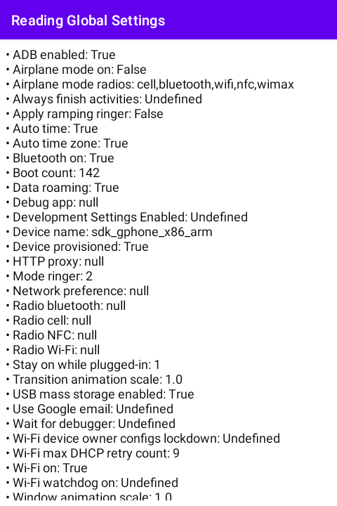

# 시작하며...

이 샘플 프로젝트는 Settings.Global 클래스를 활용하여 안드로이드 기기의 글로벌 세팅을 읽는 방법을 보여 드립니다.

---

# 스크린샷

MainActivity는 글로벌 세팅을 읽은 결과를 보여줍니다.

---

# 레퍼런스

* [Setting class](https://developer.android.com/reference/android/provider/Settings)
* [Settings.Global class](https://developer.android.com/reference/android/provider/Settings.Global)