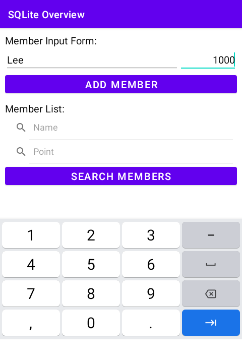

# 시작하며...

이 샘플 프로젝트는 SQLite 데이터베이스를 활용하는 예를 보여 드립니다.

---

# 스크린샷

MainActivity에서는 멤버를 추가, 조회, 수정, 삭제할 수 있습니다. 
이 때 SQL 쿼리를 활용합니다.
아래 스크린샷은 앱 초기 실행시 비어있는 양식입니다.

---

# 멤버 추가

이름, 포인트를 입력 후 ADD MEMBER 버튼을 클릭하면, 새로운 멤버가 Member 테이블에 추가 됩니다.

### 예 - 이름, 포인트 입력

---

# 멤버 조회

Member List 섹션의 양식 입력 없이 SEARCH MEMBERS 버튼을 클릭하면, 
Member 테이블에 저장된 모든 회원들을 리스트로 보여줍니다. 
이름이나 포인트를 입력하여 특정 회원 검색도 가능합니다.

### 전체 회원 조회

### 특정 이름의 회원 조회

### 특정 포인트의 회원 조회

---

# 멤버 수정

조회한 회원 리스트에서 특정 회원의 행(row)을 길게 터치하면, 
팝업 메뉴가 뜹니다. 

Edit 항목을 클릭하면, 수정 화면으로 이동합니다. 
수정 화면에서 이름과 포인트를 수정할 수 있습니다.

---

# 멤버 삭제

조회한 회원 리스트에서 특정 회원의 행(row)을 길게 터치하면, 
팝업 메뉴가 뜹니다.
Delete 항목을 클릭하면, 
해당 회원 정보는 Member 테이블에서 삭제됩니다.

---

# 레퍼런스

* From developer.android.com
  * [Switch class](https://developer.android.com/reference/android/widget/Switch)
  * [안드로이드 스위치 버튼 꾸미기](https://black-jin0427.tistory.com/81)
