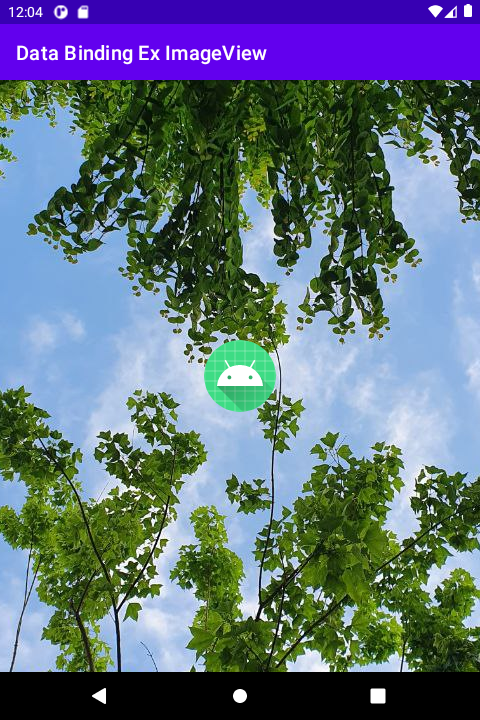

# 시작하며...

이 샘플 프로젝트는 데이터 바인딩을 이미지 뷰(ImageView)에 적용하는 1번째 예를 보여 드립니다.

---

# 스크린샷

MainActivity에는 2개의 ImageView 뷰들이 있습니다. 
하나는 화면의 배경 이미지이고, 
다른 하나는 화면 한가운데 위치한 앱 아이콘(안드로이드 스튜디오에서 제공하는 기본 아이콘)입니다.



---

# 바인딩뷰 할 데이터

뷰와 연결할 데이터는 
배경 이미지의 URL과 
앱 아이콘의 리소스 ID입니다. 
이들을 이미지 뷰와 연결할 것입니다.

```
<data>
    <!-- 배경 이미지 URL -->
    <variable
        name="imageURL"
        type="String" />

    <!-- 앱 아이콘의 리소스 ID -->
    <variable
        name="imageResID"
        type="Integer" />
</data>
```
(from activity_main.xml)

---

# 바인딩 할 뷰

위에서 정의한 데이터를 이미지 뷰와 연결합니다. 
android:src 속성에 이들을 지정하면 됩니다. 
그러나 
이 속성의 데이터 타입은 이미지를 나타내는 drawable입니다.  
위에서 정의한 데이터들의 타입은 String, Integer이며 
drawable이 아닙니다. 
그렇지만 바인딩 어댑터를 사용하면, 
임의의 데이터 타입으로도 데이터 바인딩을 적용할 수 있습니다.

```
<androidx.constraintlayout.widget.ConstraintLayout
    android:layout_width="match_parent"
    android:layout_height="match_parent">

    <!-- 화면의 배경 이미지 -->
    <ImageView
        android:layout_width="0dp"
        android:layout_height="0dp"
        android:scaleType="center"
        android:src="@{imageURL}"
        app:layout_constraintBottom_toBottomOf="parent"
        app:layout_constraintLeft_toLeftOf="parent"
        app:layout_constraintRight_toRightOf="parent"
        app:layout_constraintTop_toTopOf="parent" />

    <!-- 화면 한가운데 위치한 앱 아이콘 -->
    <ImageView
        android:layout_width="wrap_content"
        android:layout_height="wrap_content"
        android:src="@{imageResID}"
        app:layout_constraintBottom_toBottomOf="parent"
        app:layout_constraintLeft_toLeftOf="parent"
        app:layout_constraintRight_toRightOf="parent"
        app:layout_constraintTop_toTopOf="parent" />

</androidx.constraintlayout.widget.ConstraintLayout>
```
(from activity_main.xml)

---

# 바인딩 어댑터 정의하기

ImageView의 android:src를 정수형인 리소스 ID로 설정하기 위한 바인딩 어댑터 메소드는 다음과 같이 정의할 수 있습니다.

```
// 이 메소드를 정의하면, ImageView의 src 속성과 정수형 데이터를 있음.
// 리소스 ID는 정수형이므로 이를 이용하여 내부 이미지 로딩 가능.
@BindingAdapter("android:src")
fun bindingImageView(iv: ImageView?, resID: Int) {
    iv?.setImageResource(resID)
}
```
(from DataBinding.kt)

ImageView의 android:src를 URL로 설정하기 위한 바인딩 어댑터 메소드는 다음과 같이 정의할 수 있습니다.

```
// 이 메소드를 정의하면 ImageView의 src 속성과 문자열 데이터를 바인딩할 수 있으며,
// 외부 이미지 URL은 문자열이므로 이를 이용하여 외부 이미지 로딩 가능.
@BindingAdapter("android:src")
fun bindingImageView(iv: ImageView, url: String) {
    Thread({
        try {
            val inputStream1 = java.net.URL(url).openStream();
            val bitmap = BitmapFactory.decodeStream(inputStream1);

            // post 메소드 사용 이유는 이 스레드는 UI 스레드가 아니므로 화면 업데이트 못 하기 때문
            iv.post {
                iv.setImageBitmap(bitmap)
            }
        }
        catch (e: IOException) {
            e.printStackTrace()
        }
    }).start()
}
```
(from DataBinding.kt)

### MainActivity.kt

바인딩 객체의 imageResID, imageURL 값을 설정하면, 자동으로 이미지가 로딩됩니다.

```
binding.imageResID = R.mipmap.ic_launcher
binding.imageURL = "https://cdn.steemitimages.com/DQmQYdEvcXw9GU5N6UPrqR3vfWMcgefPzmM1UpeqVam7DcH/IMAGE%202021-04-25%2009:31:43.png"
```

---

# 레퍼런스

* From developer.android.com
  * [시작하기](https://developer.android.com/topic/libraries/data-binding/start?hl=ko)
  * [레이아웃 및 결합 표현식](https://developer.android.com/topic/libraries/data-binding/expressions?hl=ko)
  * [바인딩 어댑터](https://developer.android.com/topic/libraries/data-binding/binding-adapters)

바인딩 어댑터는 부분적으로만 알고 있네요. 나머지도 시간 투자해서 이해해야 하겠습니다.