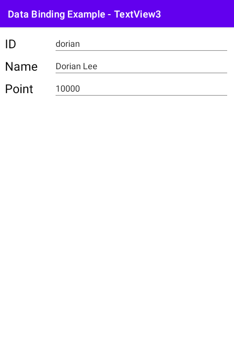

# 시작하며...

이 샘플 프로젝트는 데이터 바인딩을 텍스트 뷰에 적용하는 3번째 예를 보여 드립니다.

---

# 스크린샷

MainActivity에 3개의 EditText 뷰가 있고, 이들은 Member 객체의 id, name, point 필드들과 바인딩 되어 있습니다. 이 변수들의 값을 바꾸면 텍스트 뷰의 내용이 바뀌는 것이지요.

---

# 레퍼런스

* From developer.android.com
  * [시작하기](https://developer.android.com/topic/libraries/data-binding/start?hl=ko)
  * [레이아웃 및 결합 표현식](https://developer.android.com/topic/libraries/data-binding/expressions?hl=ko)
