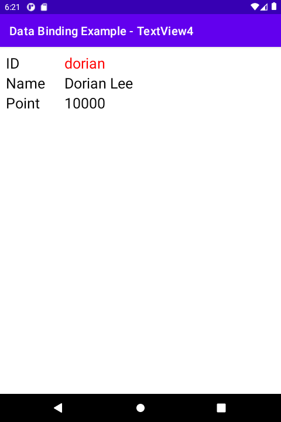

# 시작하며...

이 샘플 프로젝트는 데이터 바인딩을 텍스트 뷰에 적용하는 4번째 예를 보여 드립니다.

---

# 스크린샷

MainActivity에는 Member 객체의 필드들과 바인딩 되는 TextView 뷰들이 있습니다. 그 중 id 필드와 바인딩 되는 텍스트 뷰의 색을 데이터 바인딩을 사용하여 빨간색으로 바꾸려고 합니다.



---

# 바인딩 객체에 변수 추가

텍스트 색을 설정하기 위해 바인딩 객체에 idTextColor 변수를 추가하였습니다.

```
<?xml version="1.0" encoding="utf-8"?>
<layout
    xmlns:android="http://schemas.android.com/apk/res/android"
    xmlns:app="http://schemas.android.com/apk/res-auto">

    <data>
        <!-- ... -->

        <variable name="idTextColor" type="Integer" />
    </data>

    <!-- ... -->
</layout>
```

---

# 텍스트 색 설정

### activity_main.xml

바인딩 객체에 정의한 idTextColor 변수를 ID를 보여줄 텍스트 뷰의 텍스트 색으로 설정합니다.

```
<TextView
    android:layout_width="match_parent"
    android:layout_height="wrap_content"
    android:text="@{member.id}"
    android:textColor="@{idTextColor}"
    android:textSize="25sp" />
```

### MainActivity.kt

바인딩 객체의 idTextColor 값을 설정하면, 바인딩 된 텍스트 뷰의 텍스트 색이 바뀝니다.

```
binding.idTextColor = resources.getColor(R.color.user_id_color, null)
```

---

# 레퍼런스

* From developer.android.com
  * [시작하기](https://developer.android.com/topic/libraries/data-binding/start?hl=ko)
  * [레이아웃 및 결합 표현식](https://developer.android.com/topic/libraries/data-binding/expressions?hl=ko)