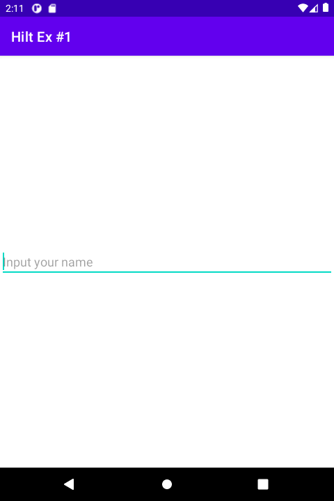
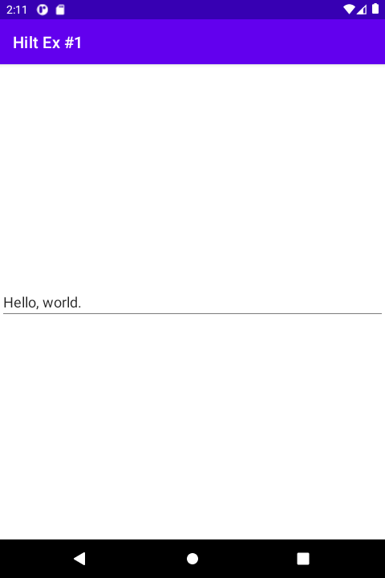

# 시작하며...

이 샘플 프로젝트는 Hilt를 활용하여 의존성 주입을 구현하는 첫번째 예제입니다. 
여기에서는 라이브러리에서 이미 구현된 클래스의 객체를 주입하는 방법을 소개합니다.

---

# 스크린샷

MainActivity에 이름을 입력할 수 있 EditText 뷰가 있습니다.



이름을 입력하기 위해 이 뷰에 타이핑할 때마다 프리퍼런스에 이름이 저장됩니다. 
백 버튼을 눌러 앱 종료 후 이를 다시 시작하면, 입력했던 이름이 복원됩니다.



이번 샘플에서는 이름을 저장하고 읽기 위한 프리퍼런스 객체 주입을 구현하였습니다.

---

# Hilt에서 @Provides를 활용한 의존성 주입 구현 방법

1. 프로젝트의 최상위 폴더에 위치한 build.gradle 파일에 다음을 추가하세요.

```
buildscript {
    // ...

    dependencies {
        // ...

        classpath "com.google.dagger:hilt-android-gradle-plugin:2.35"
    }
}
```

참고로 hilt 라이브러리의 최신 버전은 아래 링크를 통해 조회하실 수 있습니다.

https://mvnrepository.com/artifact/com.google.dagger/hilt-android-gradle-plugin

2. 모듈 폴더에 위치한 build.gradle 파일에 다음을 추가하세요.

```
plugins {
    // ...
    id 'dagger.hilt.android.plugin'
}

dependencies {
    // ...
    implementation 'com.google.dagger:hilt-android:2.35'
    kapt 'com.google.dagger:hilt-android-compiler:2.35'
}
```

3. Application 클래스를 상속받는 새로운 클래스를 프로젝트에 추가하세요. 그리고 이 클래스에 @HiltAndroidApp 애노테이션을 추가해 주세요.

```
@HiltAndroidApp
class HiltExApplication : Application() {
}
```

4. 의존성 주입을 담당할 모듈 클래스를 프로젝트에 추가하세요.

**클래스에 추가할 애노테이션들**

* @Module: 
* @InstallIn: 의존성 주입할 객체의 생명주기를 정의합니다. 그 안에 들어갈 파라메터는 다음 중 하나입니다.
** SingletonComponent::class
** ActivityRetainedComponent
** ActivityComponent::class
** FragmentComponent::class
** ViewComponent::class
** ViewWithFragmentComponent::class
** ServiceComponent::class

@InstallIn에 들어갈 파라메터 값에 대한 설명은 아래 링크를 참조하세요.

https://developer.android.com/training/dependency-injection/hilt-android?hl=ko#generated-components

**적용 예**

SharedPreferences 객체 주입을 수행할 모듈 클래스입니다. 
@InstallIn의 파라메터는 앱이 시작할 때부터 종료할 때까지 이 객체를 사용하기 위해 SingletonComponent::class를 선택했습니다.

```
@Module
@InstallIn(SingletonComponent::class)
object SharedPreferencesModule {
}
```

5. 의존성 주입을 실행할 함수를 4에서 정의한 클래스에 정의하세요.

**추가할 애노테이션들**

* @Provides: 필수 애노테이션이며, 이 함수를 통해 리턴 타입의 객체가 주입됨을 명시합니다.
* @Singleton: 주입할 객체가 단 1개만 생성되기를 원하면, 이를 추가해 주세요.

**함수에 정의할 파라메터들**

* context: Context
** 의존성 주입할 객체에게 Context가 필요하면, 이 파라메터를 함수에 추가하세요.
** 사용 가능한 애노테이션
*** @ApplicationContext: 주입할 객체에게 애플리케이션 컨텍스트가 필요할 때 사용
*** @ActivityContext: 주입할 객체에게 액티비티 컨텍스트가 필요할 때 사용
* 의존성 주입할 객체 안에 추가로 주입할 객체 (이번 샘플에는 없으나 다음 또는 다다음 샘플에서 보여 드릴 예정)

**적용 예**

```
@Module
@InstallIn(SingletonComponent::class)
object SharedPreferencesModule {

    @Provides
    @Singleton
    fun providesSharedPreferences(@ApplicationContext context: Context): SharedPreferences {
        val sp = context.getSharedPreferences(context.packageName, Context.MODE_PRIVATE)
        return sp
    }

}
```

SharedPreferences 객체를 생성하려면 Context가 필요합니다. 
따라서 providesSharedPreferences 함수에 Context 파라메터를 추가하였습니다.

6. 의존성 주입 객체를 활용할 앱 컴포넌트 클래스에 @AndroidEntryPoint 애노테이션을 추가하세요.

**예**

MainAcivity 클래스에 SharedPreferences 객체를 주입하기 위해 @AndroidEntryPoint를 추가합니다.

```
@AndroidEntryPoint
class MainActivity : AppCompatActivity() {
    // ...
}
```

7. 대상 앱 컴포넌트 A에 의존성 주입 객체 B를 필드로 정의하고, 거기에 @Inject 애노테이션을 필드의 좌측에 추가하세요. 
이것은 A 객체에 B 객체를 주입하겠다는 것을 의미합니다.

**예**

MainActivity 클래스에 SharedPreferences 객체를 주입하는 예입니다.

```
@AndroidEntryPoint
class MainActivity : AppCompatActivity() {

    @Inject
    lateinit var sp: SharedPreferences

    // ...
}
```

8. 이후 의존성 주입된 객체를 활용할 수 있습니다.

**예**

7단계 후 MainActivity 객체는 SharedPreferences 객체를 사용할 수 있습니다.

---

# 레퍼런스

* [Hilt를 사용한 종속 항목 삽입](https://developer.android.com/training/dependency-injection/hilt-android?hl=ko)
* [Android DI with Hilt - Hilt를 이용한 의존성 주입 (from jaeyeong951.medium.com)](https://jaeyeong951.medium.com/android-di-with-hilt-hilt%EB%A5%BC-%EC%9D%B4%EC%9A%A9%ED%95%9C-%EC%9D%98%EC%A1%B4%EC%84%B1-%EC%A3%BC%EC%9E%85-5076d9e9c46b)
* [Hilt와 함께 제대로 찔러보자 안드로이드 의존성 주입 (옥수환 님)](https://drive.google.com/file/d/11YyGGxoIkzaWG14PE7vAjSrFW1MhGPEL/view)