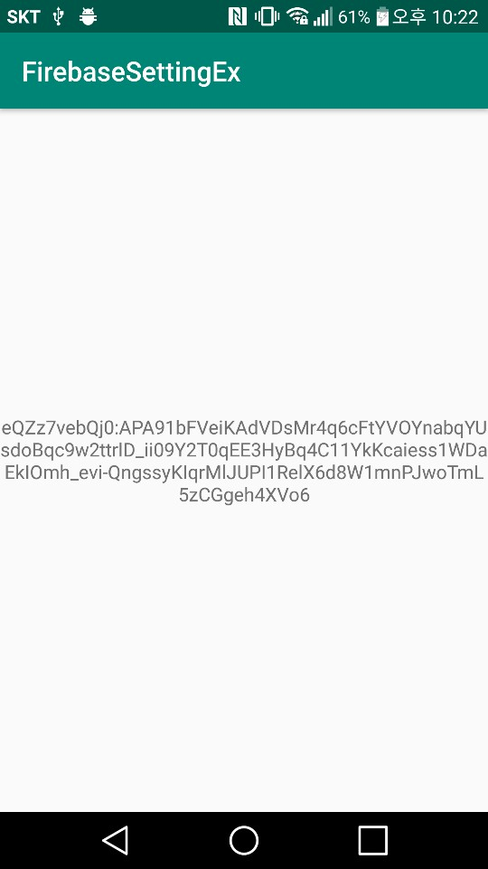

# Introduction

This project is an example of reading the device registration token needed to receive FCM messages

# Description

This example demonstrates
* how to initiate FirebaseApp instance
* how to check if Google Play Service is available
* how to read the device registration token needed to receive FCM messages

# Screenshot

</img>

The main activity shows a device registration token read from GMS(Google Mobile Services)

# References

* Add Firebase to your Android project
  * https://firebase.google.com/docs/android/setup?hl=en
* Set up a Firebase Cloud Messaging client app on Android
  * https://firebase.google.com/docs/cloud-messaging/android/client?hl=en
