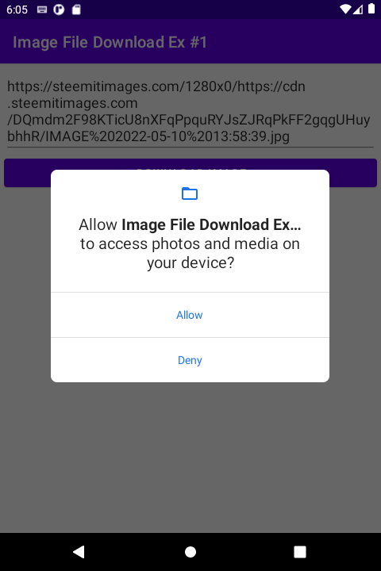
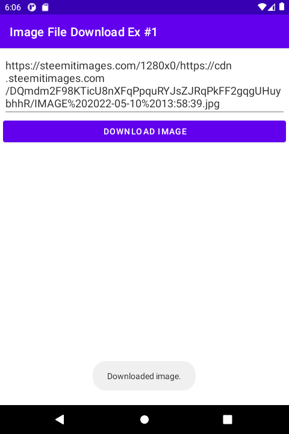
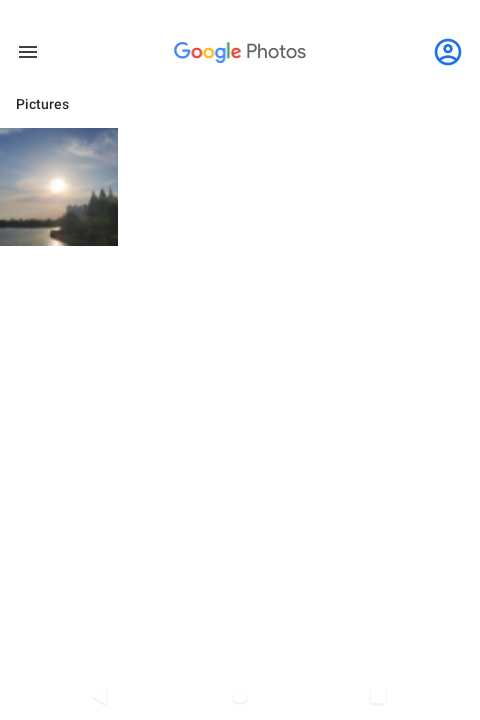

# 시작하며...

이 샘플 모듈의 개발 목적은 다음과 같습니다.

* Glide 라이브러리를 활용하여 이미지를 다운로드하는 방법을 이해한다.
* 안드로이드 11 이후로 달라진 이미지 파일 저장 방법을 이해한다.

---

# 스크린샷

이미지 URL을 입력하는 양식이 있습니다. 
URL을 입력하고 DOWNLOAD IMAGE 버튼을 클릭하면, 이미지 다운로드가 시작됩니다. 
그런데 이 버튼을 맨 처음 클릭할 때 앱은 사진과 미디어 접근을 허용할지 사용자에게 물어보는 팝업을 띄웁니다. 
아래 그림에서 Allow 버튼을 클릭해야 다운로드가 시작됩니다.

다운로드를 마치면, 토스트로 완료되었음을 알립니다.

갤러리 앱을 실행하면, 다운로드 받은 이미지를 확인할 수 있습니다.

 

---

# 이미지 다운로드

이미지 다운로드는 2단계로 구분됩니다.

(1) Glide 라이브러리를 활용하여 이미지를 서버로부터 받습니다.
(2) 다운로드 받은 이미지를 파일로 저장합니다.

---

# 이미지를 파일로 저장시 주의할 점

안드로이드 11부터 앱들은 안드로이드가 허용하는 경로 외에 임의로 저장공간에 폴더를 만들 수 없나 파일 저장 또한 불가합니다. 
보다 자세한 내용은 아래 레퍼런스를 참고하시기 바랍니다.

---

# 여담

**2022년 5월 13일 (금)** 
강의시간표 이미지를 다운로드 받을 수 있게 해달라는 요청을 받았고, 
이를 구현하기 위해 Glide 라이브러리 사용 방법을 이번에 배웠습니다.

---

# 레퍼런스

이번 샘플 코드를 만들기 위해 아래 레퍼런스들을 참고했습니다.

* [How to Save Image to storage using Glide in Android](https://akshayranagujjar.medium.com/how-to-save-image-to-storage-using-glide-in-android-fa26c842f212)
* [Android 11 Scoped Storage - Saving Files To Shared Storage](https://androidexplained.github.io/android/android11/scoped-storage/2020/09/29/file-saving-android-11.html)
* [Android 11 대응 - 2. 범위 지정 저장소 적용](https://dl137584.github.io/2022/02/16/017-android11-scoped-storage/)