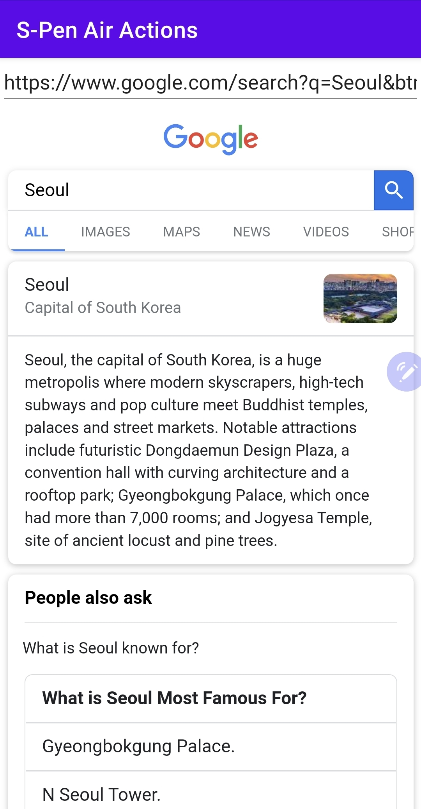

# 시작하며...

이 샘플 모듈은 다음을 목적으로 개발하였습니다.

* S펜의 에어 액션을 정의하고 앱에 적용하는 방법을 이해한다.

---

# 스크린샷

MainActivity 시작 후, 화면 상단의 EditText 뷰에 HTTP URL을 입력하여 웹 사이트 접속 가능합니다. 
(예: google.com) 
이후 S펜을 사용하여 제스처, 버튼 클릭 등의 에어 액션을 실행할 수 있습니다.



---

# 정의한 에어 액션

이 앱에서 정의한 S펜의 에어 액션들은 다음과 같습니다.

* 좌에서 우로: 앞 페이지로 
* 우에서 좌로: 뒤 페이지로
* 위에서 아래로: 페이지 다운
* 아래에서 위로: 페이지 업
* 버튼 클릭: URL 복사
* 버튼 더블 클릭: 새로고침

---

# S펜의 에어 액션 적용 방법

1. AndroidManifest.xml 파일에서 에어 액션을 적용할 액티비티 클래스를 선택하세요.

2. 1에서 선택한 액티비티 클래스에 아래와 같이 intent-filter와 meta-data를 추가하세요.

```
<activity android:name=".MainActivity">
    <!-- 기존 intent-filter가 있으면, 지우지 말고 그대로 두세요. -->

    <intent-filter>
        <action android:name="com.samsung.android.support.REMOTE_ACTION" />
    </intent-filter>
    <meta-data
        android:name="com.samsung.android.support.REMOTE_ACTION"
        android:resource="@xml/air_actions" />
</activity>

```

3. 에어 액션을 정의할 xml 파일을 생성하세요.

* 경로: {프로젝트}/{모듈}/src/main/res/xml (xml 폴더가 없으면, 이를 생성하세요.)
* 파일 이름의 예: air_actions.xml
* remote-actions 태그
  * version: 최근 버전 (2022년 4월 7일 기준 1.2)
  * enable_key
    * 앱 설치후 에어 액션 자동 적용하려면, 이 속성 필요
    * 이 키값을 받으려면, 메일로 신청해야 함 (FAQ의 Q5 참고)

```
<?xml version="1.0" encoding="utf-8"?>
<remote-actions version="1.2">
</remote-actions>
```

4. 에어 액션을 정의하는 action 태그를 remote-action 태그 안에 추가하세요.

* action 태그의 속성
  * id
    * 에어 액션을 식별하는 고유 값
  * label
    * S펜 설정 앱에서 보이는 에어 액션 이름
    * stringx.xml 파일에 정의한 문자열을 사용해야 함
  * priority: 우선순위
  * trigger_key
    * 에어액션으로 발생하는 키 이벤트
    * CTRL, SHIFT 키 등을 조합하여 이미 존재하는 키 조합과 충돌을 피하는 것이 좋습니다.
    * 예
      * "C": C 키 누름
      * "BACK": Back 키 누름
      * "SPACE": Space 키 누름
      * "VOLUME_UP": Volume up 키 누름
      * "DPAD_LEFT": 왼쪽 방향키 누름
      * "CTRL_LEFT+C": Ctrl 왼쪽 키, C 키 동시 누름
      * "CTRL_LEFT+SHIFT_LEFT+C": Ctrl 왼쪽 키, Shift 왼쪽 키, C 키 동시 누름
* preference 태그의 속성
  * name: "gesture"로 설정
  * value: 제스처의 종류를 설정
    * "click": 클릭
    * "double_click": 더블 클릭
    * "swift_left": 우에서 좌로
    * "swift_right": 좌에서 우로
    * "swift_up": 아래에서 위로
    * "swift_down": 위에서 아래로

**예1 - 버튼 클릭**<br/>

```
<action
    id="copy_url"
    label="@string/airaction_copy_url"
    priority="1"
    trigger_key="CTRL_LEFT+SHIFT_LEFT+C">
    <preference
        name="gesture"
        value="click" />
</action>
```

**예2 - 우에서 좌로 제스처**<br/>

```
<action
    id="back"
    label="@string/airaction_back"
    priority="2"
    trigger_key="CTRL_LEFT+BACK">
    <preference
        name="gesture"
        value="swipe_left" />
</action>
```

5. 1에서 선택한 액티비티 클래스에서 키 누름(key down) 이벤트를 구현하세요.

* 대상 키
  * 4에서 선택한 키들
* 이벤트 구현 방법
  * onKeyDown 함수 구현
    * 주의: 액티비티에 EditText와 같이 포커스가 필요한 뷰가 있으면, 액티비티 대신 해당 뷰에서 키 이벤트를 처리할 수 있습니다.
  * dispatchKeyEvent 함수 구현
    * 액티비티에 포커스를 가져가는 뷰가 있으면, 이 함수에서 구현을 고려해볼 수 있습니다.
  
**예1 - 4의 예1에 정의한 에어 액션의 키 누름 처리**<br/>

```
override fun dispatchKeyEvent(event: KeyEvent?): Boolean {
    val isCtrlPressed = event?.isCtrlPressed ?: false
    val isShiftPressed = event?.isShiftPressed ?: false
    val isKeyDown = (KeyEvent.ACTION_DOWN == event?.action)

    if (!isKeyDown) {
        return false
    }

    when (event?.keyCode) {
        KeyEvent.KEYCODE_C -> {
            if (isCtrlPressed and isShiftPressed) {
                copyToClipboard(views.etURL.text.toString())
                Toast.makeText(this, "Copied URL.", Toast.LENGTH_SHORT).show()
                return true
            }
        }

        // ...
    }

    return super.dispatchKeyEvent(event)
}
```

**예2 - 4의 예2에 정의한 에어 액션의 키 누름 처리**<br/>

```
override fun dispatchKeyEvent(event: KeyEvent?): Boolean {
    val isCtrlPressed = event?.isCtrlPressed ?: false
    val isShiftPressed = event?.isShiftPressed ?: false
    val isKeyDown = (KeyEvent.ACTION_DOWN == event?.action)

    if (!isKeyDown) {
        return false
    }

    when (event?.keyCode) {
        // ...

        KeyEvent.KEYCODE_BACK -> {
            if (isCtrlPressed and isShiftPressed) {
                wvContent.goForward {}
            }
            else if ((isCtrlPressed) or (!isCtrlPressed and !isShiftPressed)) {
                wvContent.goBack { finish() }
            }
            else {
                return false
            }

            return true
        }

        // ...
    }

    return super.dispatchKeyEvent(event)
}
```

---

# 여담

**2022년 4월 7일 (목)**<br/>
매뉴얼은 있지만, 다른 자료들이 없어 S펜의 에어액션 적용에 애를 먹었습니다. 
어렵사리 구현하고 나니 방법이 그리 복잡하지는 않았습니다. 
그러나 훗날 혹시라도 동일한 작업에 대비해 자료 정리가 반드시 필요합니다. 
이에 샘플 코드와 설명을 작성해 둡니다. 
S펜 에어 액션 적용에 어려움을 겪는 분들에게 조금이라도 도움이 되기를 바랍니다.
  
---

# 레퍼런스

* [Air Actions](https://developer.samsung.com/galaxy-spen-remote/air-actions.html)
  * 에어 액션 적용 방법이 설명되어 있습니다.
* [FAQ](https://developer.samsung.com/galaxy-spen-remote/faq.html)
  * 에어 액션 관련 FAQ
  * 그 중 참고했던 Q&A
    * Q4. Sample application doesn’t respond to S-Pen gestures
    * Q5. My application doesn’t respond to S-Pen gestures.
    * Q6. I have implemented RemoteActions, but it is not displayed in the Air actions settings.
* [Galaxy S Pen Remote - Downloads](https://developer.samsung.com/galaxy-spen-remote/download.html)
  * 에어액션 샘플 코드를 다운로드 받을 수 있습니다. (로그인 필요)