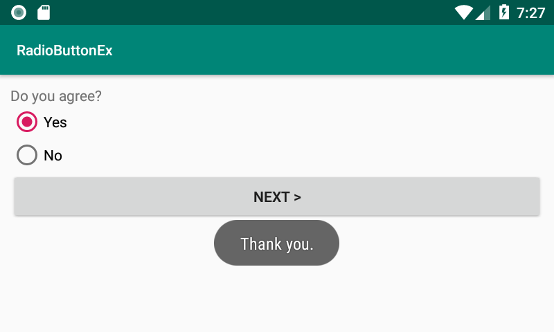

# Introduction

This project is an example of RadioButton and RadioGroup views.

# Description

This example demonstrates
* how to define RadioButton and RadioGroup views in an XML file.
* how to set the default date of a DatePicker view.
* how to read year, month and day of month from a DatePicker view.

# Screenshot

</img>

If you click one of radio buttons and click OK button, the application shows which one is selected with a toast.

</img>

# References

* RadioButton Class
  * https://developer.android.com/reference/android/widget/RadioButton
* RadioGroup Class
  * https://developer.android.com/reference/android/widget/RadioGroup