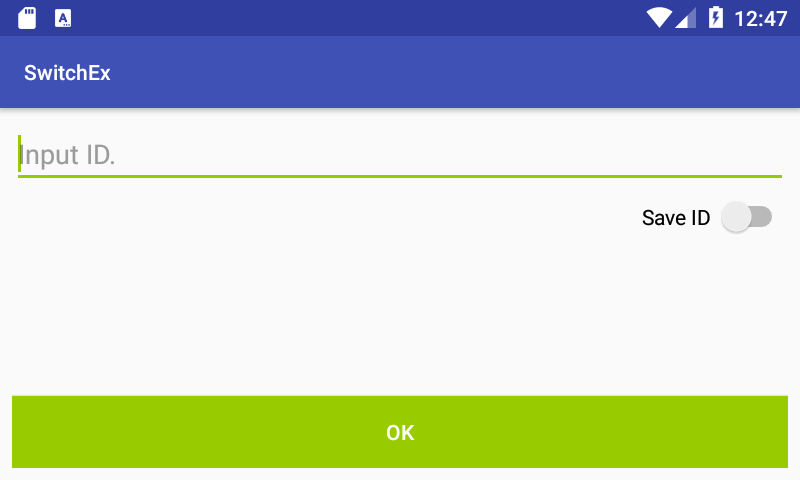
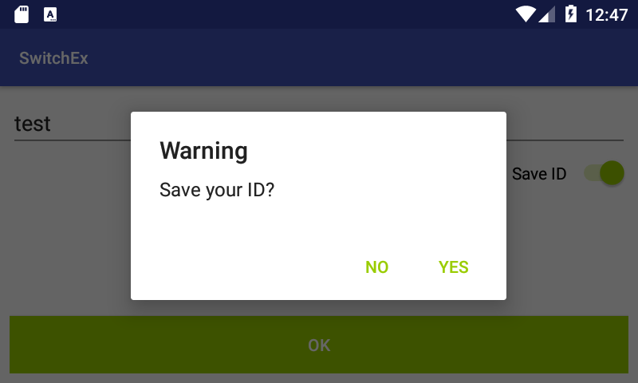
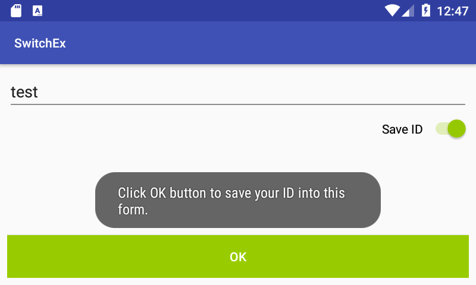
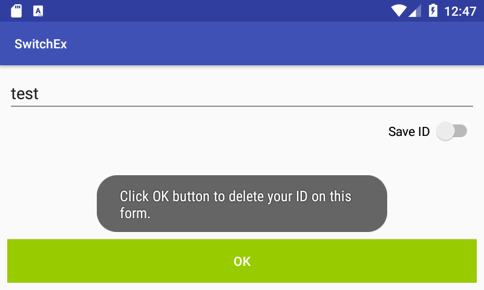

# Introduction

This project is an example of Switch view.

# Description

This example demonstrates
* how to define a Switch view in an XML file.
* how to handle togging a Switch view.

# Screenshot

</img>

The above shot is initial display of the example.

</img>

If you turns on 'Save ID' switch, this app opens an alert dialog to ask if ID is to be saved.

</img>

After clicking YES, the app opens a toast to notify that the ID will be saved by clicking OK button.

</img>

After clicking OK, the app opens a toast to notify that the ID has been saved into its preferences.

</img>

After switching off 'Save ID' switch, the app oepns a toast to notify that the ID is deleted by clicking OK button.

# References

* Switch Class
  * https://developer.android.com/reference/android/widget/Switch
