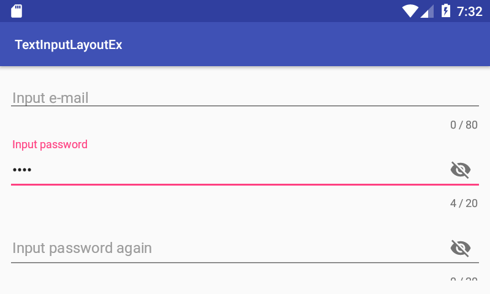

# Introduction

This project is an example of TextInputLayout view.

# Description

This example demonstrates
* how to define a TextInputLayout view in an XML file.

# Screenshot

</img>

The above shot is initial display of the example.

</img>

Trying to input a password. It is hidden.

</img>

If you click the eye icon of TextInputLayout view, its hidden password is shown. If the icon is clicked again, the password is hidden again. 

# References

* TextInputLayout Class
  * https://developer.android.com/reference/android/support/design/widget/TextInputLayout
