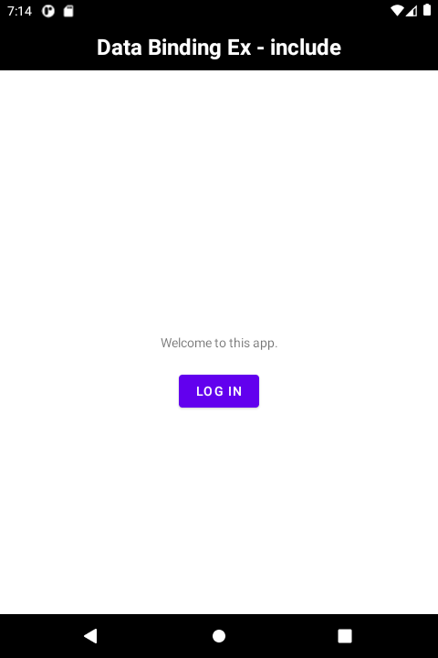
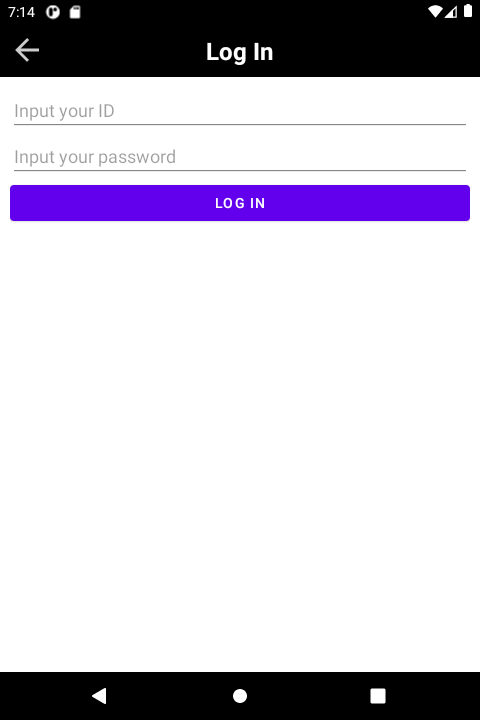

# 시작하며...

이 샘플 프로젝트는 include 태그를 이용하여 화면에 추가될 레이아웃에 데이터 바인딩을 적용하는 1번째 예를 보여 드립니다.

---

# 스크린샷

MainActivity에는 상단에 툴바(toolbar)가 있고, 그것은 include 태그를 사용하여 추가하였습니다. 



위 화면에서 Log In 버튼을 클릭하면 로그인 화면으로 이동합니다. 
로그인 화면의 상단에도 툴바가 있습니다. 이번 툴바에는 메인 화면에서 보이지 않았던 백 버튼이 좌측에 있습니다.



---

# 바인딩뷰 할 데이터

먼저 include 할 레이아웃 파일에 
data 태그를 추가하고, 
그 안에 바인딩할 변수들을 정의합니다.
title은 툴바에 제목을 보여주기 위한 변수이고, 
isBackButtonVisible 변수는 
백 버튼을 보여줄지 결정하는데 필요한 플래그입니다.

```
<data>
    <import type="android.view.View" />

    <variable
        name="title"
        type="String" />

    <variable
        name="isBackButtonVisible"
        type="Boolean" />
</data>
```
(from layout_toolbar.xml)

이 레이아웃을 포함할 activity_main.xml 파일에는 
위에서 정의한 것과 동일한 형식의 변수들을 정의합니다.
이번 예제의 경우 layout_toolbar.xml 파일에 정의한
title, isBackButtonVisible 변수를 
activity_main.xml 파일에도 정의합니다.

```
<data>
    <variable
        name="title"
        type="String" />

    <variable
        name="isBackButtonVisible"
        type="Boolean" />

    <variable
        name="welcomeMessage"
        type="String" />
</data>
```
(from activity_main.xml)

---

# include 태그로 레이아웃 추가

include 태그 작성할 때, 
layout_toolbar.xml 파일의 변수들의 값을 지정해 주세요. 
형식은 다음과 같습니다.

```
app:변수명="@{값}"
```

include 태그에 android:id 속성도 추가해야 합니다. 
그래야 바인딩 객체가 하위 뷰(이 예에서는 tvTitle, ivBackButton 뷰)에 접근할 수 있습니다.

아래 예는 layout_toolbar.xml로 정의하는 레이아웃의 title, isBackButtonVisible 
변수들의 값들을 지정하고 있습니다.

```
<include
    android:id="@+id/includeToolbar"
    layout="@layout/layout_toolbar"
    app:title="@{title}"
    app:isBackButtonVisible="@{isBackButtonVisible}" />
```
(from activity_main.xml)

---

# 바인딩 할 뷰 - layout_toolbar.xml

layout_toolbar.xml 파일에서 바인딩 할 뷰는 
텍스트 뷰와 이미지 뷰입니다.
전자는 화면에서 타이틀을 보여주기 위한 것이고, 
후자는 백 버튼을 보여줄지를 결정하기 위한 것입니다.
이 파일의 title 변수를 이 텍스트 뷰와 바로 바인딩합니다.
isBackButton 변수는 Boolean 타입이지만,
이미지 뷰를 보여줄지 설정하는 속성인 visibility의 데이터 형은  
Boolean이 아닌 Integer입니다.
따라서 이 변수는 뷰와 바로 바인딩할 수 없고
그 대신 Boolean 값에 따라 다른 Integer 값을 설정할 수 있습니다.

```
<ImageView
    android:id="@+id/ivBackButton"
    android:layout_width="wrap_content"
    android:layout_height="wrap_content"
    android:layout_centerVertical="true"
    android:layout_marginLeft="15dp"
    android:src="@drawable/ic_back_button"
    android:visibility="@{isBackButtonVisible ? View.VISIBLE : View.GONE}"/>
```
(from layout_toolbar.xml)

---


# MainActivity 클래스

바인딩 객체의 title, isBackButtonVisible 변수들에 값을 설정하면, 자동으로 툴바의 타이틀과 백버튼 보여줄지가 결정됩니다.

```
binding.title = getString(R.string.app_name)
binding.isBackButtonVisible = false
```

---

# 레퍼런스

* From developer.android.com
  * [시작하기](https://developer.android.com/topic/libraries/data-binding/start?hl=ko)
  * [레이아웃 및 결합 표현식](https://developer.android.com/topic/libraries/data-binding/expressions?hl=ko)
* [How to access view via ID inside a included layout](https://stackoverflow.com/questions/38969296/android-data-binding-how-to-access-view-via-id-inside-a-included-layout)
