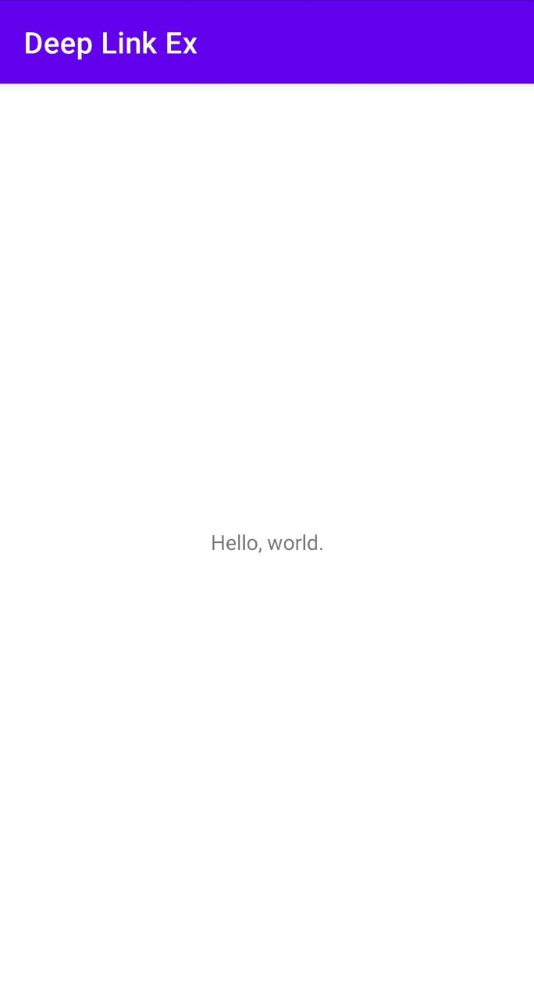

# 시작하며...

이 샘플 모듈의 개발 목적은 다음과 같습니다.

* S펜의 에어 액션을 정의하고 앱에 적용하는 방법을 이해한다.

---

# 스크린샷

아래 딥링크를 실행하면, 아래 그림과 같이 MainActivity가 실행됩니다.

dorian://deep_link_test



URL에 name 파라메터를 설정하면, 인사 메시지에 이름도 같이 화면에 보여줍니다.

dorian://deep_link_test?name=lee


---

# 딥 링크 적용 방법

1. AndroidManifest.xml 파일에서 딥 링크를 적용할 액티비티 클래스를 선택하세요.

2. 딥 링크의 scheme과 host를 정의하세요. 파라메터는 필요하면 추가해도 좋습니다. 

**예**<br/>
이 샘플에서는 MainActivity를 딥 링크로 실행하기 위해 아래와 같이 scheme, host를 정의했습니다.

* Scheme: dorian
* Host: deep_link_test
* 파라메터 (옵션)
  * name: 사람 이름. 용도는 화면에 보여주기.


3. 1에서 선택한 액티비티 클래스에 아래와 같이 intent-filter를 추가하세요.

```
<activity android:name="lee.dorian.android.deep_link_ex01.MainActivity">
    <intent-filter>
        <action android:name="android.intent.action.MAIN" />

        <category android:name="android.intent.category.LAUNCHER" />
    </intent-filter>

    <!-- 추가할 intent-filter -->
    <intent-filter>
        <action android:name="android.intent.action.VIEW" />

        <category android:name="android.intent.category.DEFAULT" />
        <category android:name="android.intent.category.BROWSABLE" />

        <!-- 2에서 정한 scheme, host를 아래 data 요소의 속성으로 설정 -->
        <data
            android:host="deep_link_test"
            android:scheme="dorian" />
    </intent-filter>
</activity>
```

4. 딥 링크에 의해 시작되었는지 확인하는 코드를 대상 액티비티에 구현하세요.

**예 - 딥 링크로 실행 여부 확인 함수**</br>

```
fun Activity.isStartedByDeepLink(): Boolean {
    return (null != intent.data) and Intent.ACTION_VIEW.equals(intent.action)
}
```

**예 - 액티비티 시작시 딥 링크 확인**<br/>

```
class MainActivity : AppCompatActivity() {

    private lateinit var views: Views

    override fun onCreate(savedInstanceState: Bundle?) {
        super.onCreate(savedInstanceState)
        setContentView(R.layout.activity_main)

        // ...

        // 아이콘 클릭 등과 같이 일반적인 실행의 경우
        if (!isStartedByDeepLink()) {
            // ... 
        }
        // 딥 링크에 의해 실행된 경우
        else {
            // ...
        }
    }
}
```

5. 딥 링크로 액티비티가 시작된 경우와 그렇지 않은 경우에 대한 추가 처리를 구현하세요.

**예**<br/>
아래 코드는 딥 링크 실행 여부에 따라 다른 내용의 인사 메시지를 화면에 보여줍니다.

* 딥 링크 실행: "Hello, 이름." 또는 "Hello, everybody." 메시지 보여줌
* 기타: "Hello, world." 메시지 보여줌

```
class MainActivity : AppCompatActivity() {

    private lateinit var views: Views

    override fun onCreate(savedInstanceState: Bundle?) {
        super.onCreate(savedInstanceState)
        setContentView(R.layout.activity_main)

        // ...

        if (!isStartedByDeepLink()) {
            views.tvMessage.text = createHelloMessage()
        }
        else {
            intent.data?.let {
                val name = it.getQueryParameter("name") ?: "everyone"
                views.tvMessage.text = createHelloMessage(name)
            }
        }
    }

    // ...
}
```

---

# 딥 링크 테스트 방법

슬랙 앱에 링크를 메시지로 올린 후, 이를 클릭하면 앱이 실행됩니다.

**예**<br/>
* dorian://deep_link_test
* dorian://deep_link_test?name=lee
---

# 향후 추가 과제

딥 링크로 실행할 화면은 1개가 아닌 여러 개일 수 있습니다. 
이를 구현하려면, 코드가 더 복잡해질 수 있죠. 
보다 효율적으로 개발할 방법이 있을지 알아볼 필요가 있습니다.

---

# 여담

**2022년 4월 18일 (월)**<br/>
웹 페이지에서 링크를 클릭하면 앱을 실행해 달라는 요청을 받아서 이를 구현했었습니다. 
그러나 최종 반영이 승인되지 않아 무한 대기 중이네요. 
올해 하반기에 앱 리뉴얼할 때 같이 반영될 것으로 예상합니다.  

---

# 레퍼런스

* [안드로이드에서 딥링크 만들기 - 페이스북에서 브랜디 앱으로 순간이동하는 방법 (김보예)](http://labs.brandi.co.kr/2018/07/18/kimby.html)