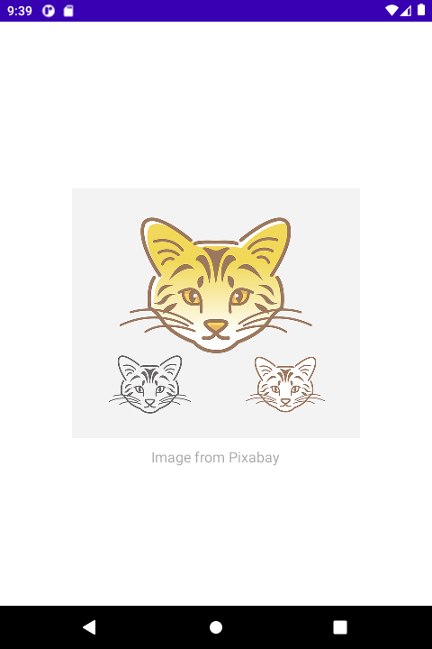
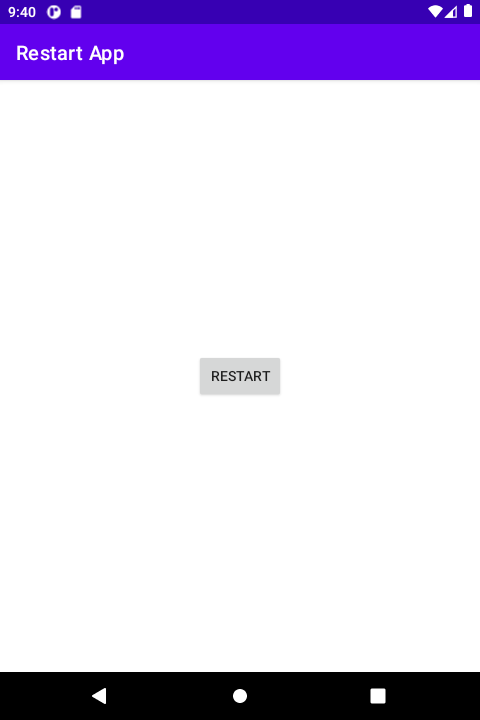

# 시작하며...

이 샘플 모듈의 개발 목적은 다음과 같습니다.

* 안드로이드 앱 재시작 하는 방법을 이해한다.

---

# 스크린샷

앱 실행 후 시작 화면이 뜹니다.



1.5초 후 메인 화면이 나타납니다.



메인 화면에서 Restart 버튼을 클릭하면, 앱이 재시작됩니다. 
이로 인해 시작 화면이 1.5초 동안 다시 나타납니다.

---

# 앱 재시작

앱 재시작은 2단계로 구분됩니다.

(1) 현재 액티비티의 finishAffinity() 메소드를 호출하여 현재 태스크의 모든 액티비티들을 종료합니다.
(2) 현재 앱의 시작 액티비티 실행에 필요한 인텐트 객체를 정의하고, 그것으로 액티비티를 실행합니다.

위 2단계를 실행하는 Activity 확장 메소드를 이번 샘플에서 정의, 사용하였습니다.

```
fun Activity.restartApp() {
    finishAffinity()
    startActivity(packageManager.getLaunchIntentForPackage(packageName))
}
```