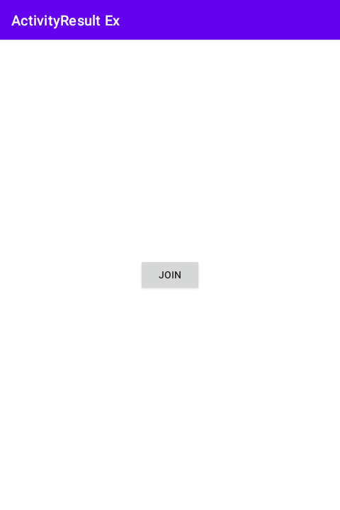
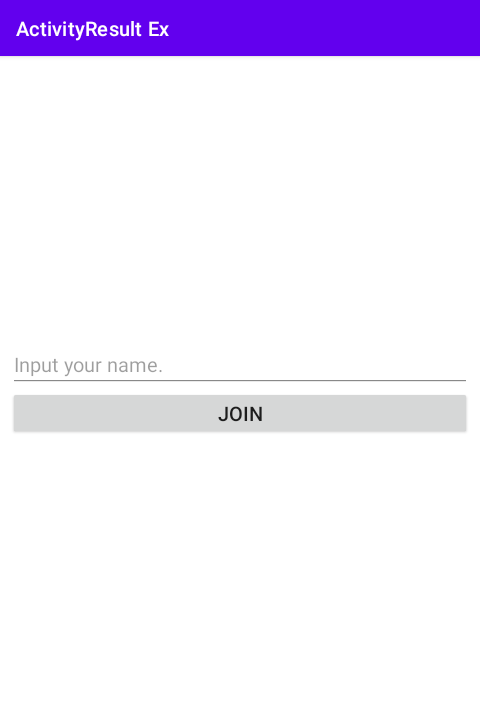
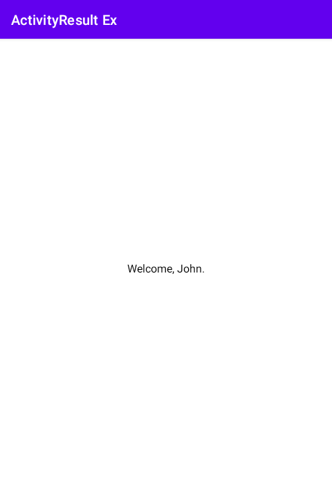

# 시작하며...

이 샘플 프로젝트는 Activity Result API를 이용하여 액티비티 실행 결과를 가져오는 방법을 보여 드립니다.

---

# 스크린샷

MainActivity에 1개의 버튼 뷰가 있습니다.

여러분이 그것을 누르면, 이 액티비티는 JoinFormActivity를 시작합니다.

입력 양식에서 닉네임을 입력하고, JOIN 버튼을 클릭하세요. 
그러면 이 화면은 종료되고 MainActivity로 복귀합니다.

MainActivity는 JoinFormActivity로부터 받은 이름을 읽고 
환영 메시지를 보여 줍니다.

---

# 레퍼런스

* [Getting a result from an activity](https://developer.android.com/training/basics/intents/result?hl=en)