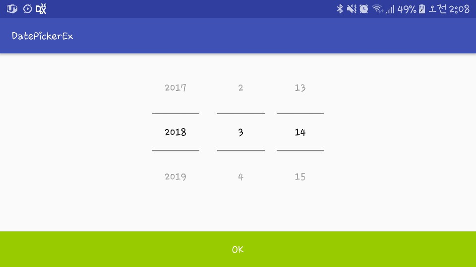
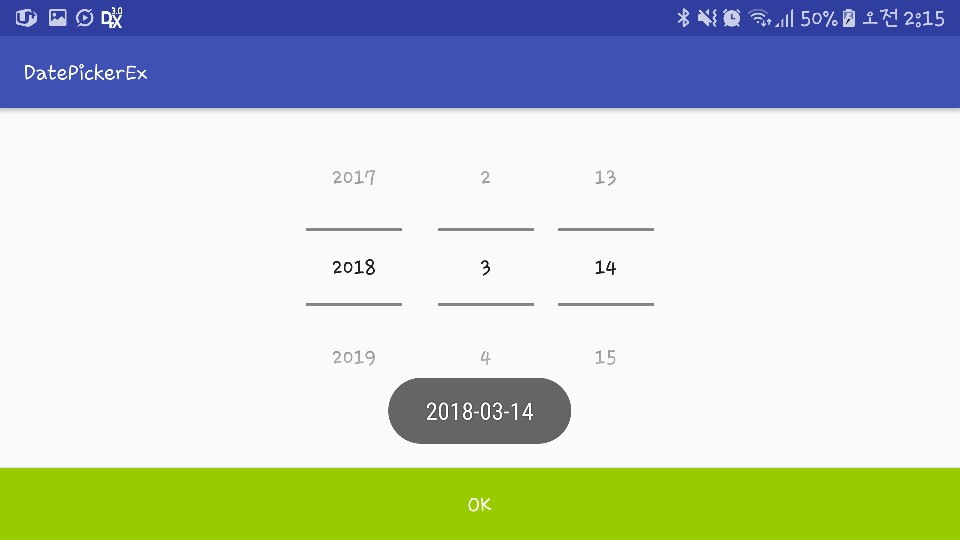

# Introduction

This project is an example of spinner-moded DatePicker view.

# Description

This example demonstrates
* how to define a DatePicker view in an XML file.
* how to set the default date of a DatePicker view.
* how to read year, month and day of month from a DatePicker view.

# Screenshot

</img>

If you click OK button, the application reads selected year, month and day. And it shows them with a toast.

</img>

# References

* DatePicker Class
  * https://developer.android.com/reference/android/widget/DatePicker.html#attr_android:datePickerMode
