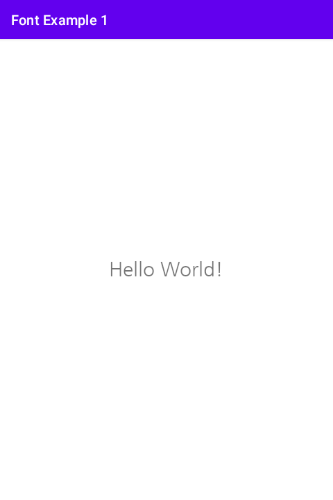

# 시작하며...

이 샘플 프로젝트는 폰트를 가져오고 이를 텍스트 뷰에 적용하는 1번째 예를 보여 드립니다. 
1번째 예에서는 XML이 아닌 자바 코드로 폰트를 설정하는 방법을 설명합니다. 
(2번째 방법은 1번째보다 늦게 만들어졌습니다.) 
XML로 폰트 설정은 2번째 예제에서 소개합니다.

---

# 스크린샷

MainActivity에는 텍스트 뷰가 있고, 그것에 나눔 고딕 폰트가 적용되어 있습니다. 



---

# 폰트 설정 방법

1. asset 폴더 생성

2. asset 폴더에 폰트 파일 복사 (예: font_nanum_gothic.ttf)

3. Typeface 객체 작성

```
val typeface = Typeface.createFromAsset(assets, "font_nanum_gothic.ttf")
```

4. 3에서 생성한 Typeface 객체를 텍스트 뷰의 타입페이스로 설정

```
val tvHelloWorld = findViewById(R.id.tvHelloWorld) as TextView
tvHelloWorld.typeface = typeface
```

---

# 레퍼런스

* [안드로이드 : Typeface (폰트 적용)](https://blog.naver.com/gi_balja/221135703797)
