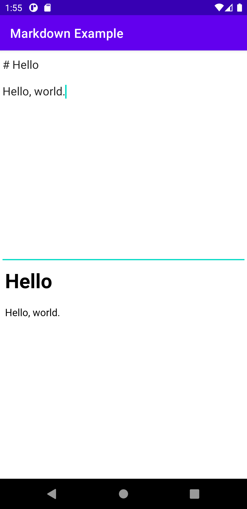
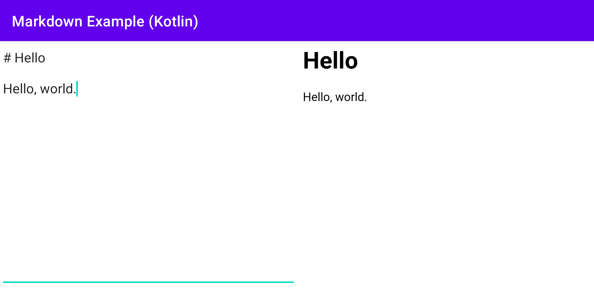

# Introduction

This sample project was created to define and show a markdown view.

---

# Screenshot

Main activity has two views. One is an edit view to input raw text, and the other is the markdown view to show the markdown text.

### Portrait Mode

#### Landscape Mode

---

# Modules

* app: The sample module implemented in Java
* app_kotlin: The sample module implemented in Kotlin

---

# References

* Markdown
  * [안드로이드에서 마크다운(Markdown)을 렌더링 할 수 있는 라이브러리를 개발하였습니다.](https://blog.naver.com/eominsuk55/220993691979)
