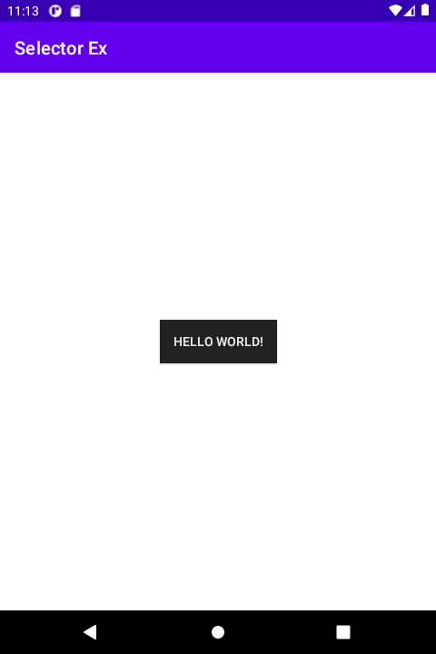
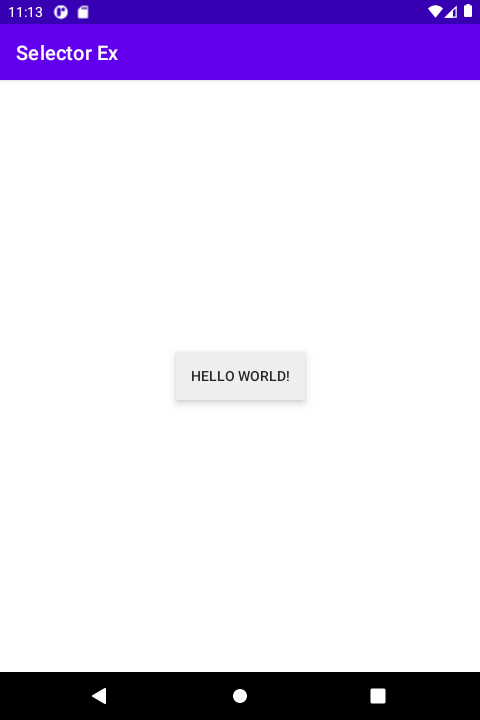
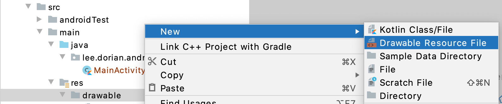
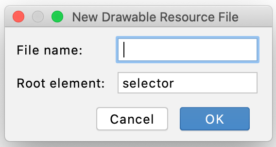

# 시작하며...

이 샘플 프로젝트는 selector 리소스를 정의하고 이를 뷰에 적용하는 예를 보여 드립니다.

---

# 스크린샷

MainActivity에 1개의 버튼 뷰가 있습니다.



여러분이 그것을 누르면, 버튼의 배경색과 텍스트 색이 바뀌는 것을 볼 수 있습니다.



---

# selector 리소스 정의, 적용 방법

1. res/drawable 폴더에 새 drawable resource XML 파일을 생성하세요.



새 XML 파일의 최상위 요소는 selector로 지정해 주세요.



그러면 아래와 같은 XML 파일이 만들어 집니다.

```
<?xml version="1.0" encoding="utf-8"?>
<selector xmlns:android="http://schemas.android.com/apk/res/android">
</selector>
```

2. selector를 적용할 뷰 속성의 기본 값을 선택하세요.

### 예

아래 예에서는 버튼의 배경인 android:background의 기본값을 selecctor에 추가합니다.

```
<?xml version="1.0" encoding="utf-8"?>
<selector xmlns:android="http://schemas.android.com/apk/res/android">

    <item android:drawable="@drawable/button_bg_not_pressed" />

</selector>
```

3. selector를 적용할 뷰 속성의 다른 값들을 정의하세요. 다른 state일 때 다른 값을 정하실 수 있습니다.

### 예

아래 예에서는 버튼이 눌렸을 때, android:background 속성이 @drawable/button_bg_pressed로 바꾸는 item이 추가되었습니다.

```
<selector xmlns:android="http://schemas.android.com/apk/res/android">

    <item android:state_pressed="true" android:drawable="@drawable/button_bg_pressed" />
    <item android:drawable="@drawable/button_bg_not_pressed" />

</selector>
```

4. 1~3에서 정의한 selector를 뷰의 속성으로 지정합니다.

### 예

이번 예는 3의 예에서 정의한 selector를 버튼 뷰의 background 속성에 지정한 것을 보여줍니다.

```
<androidx.appcompat.widget.AppCompatButton
    android:layout_width="wrap_content"
    android:layout_height="wrap_content"
    android:background="@drawable/selector_button_bg"
    android:text="Hello World!" />
```

---

# 레퍼런스

* [[안드로이드] xml selector - 버튼 눌림(클릭) 효과 커스텀하여 만들기](https://sharp57dev.tistory.com/13)
* [color 를 drawable 로 사용하기(selector 리소스내에서)](https://chrisjhyoon.wordpress.com/2014/10/24/color-%EB%A5%BC-drawable-%EB%A1%9C-%EC%82%AC%EC%9A%A9%ED%95%98%EA%B8%B0selector-%EB%A6%AC%EC%86%8C%EC%8A%A4%EB%82%B4%EC%97%90%EC%84%9C/)
* [[Andoird] Button 클릭 시, textColor 변경](https://gogorchg.tistory.com/entry/Andoird-Button-%ED%81%B4%EB%A6%AD-%EC%8B%9C-textColor-%EB%B3%80%EA%B2%BD)