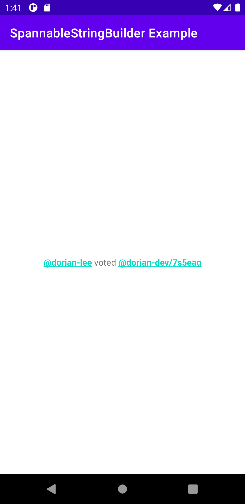
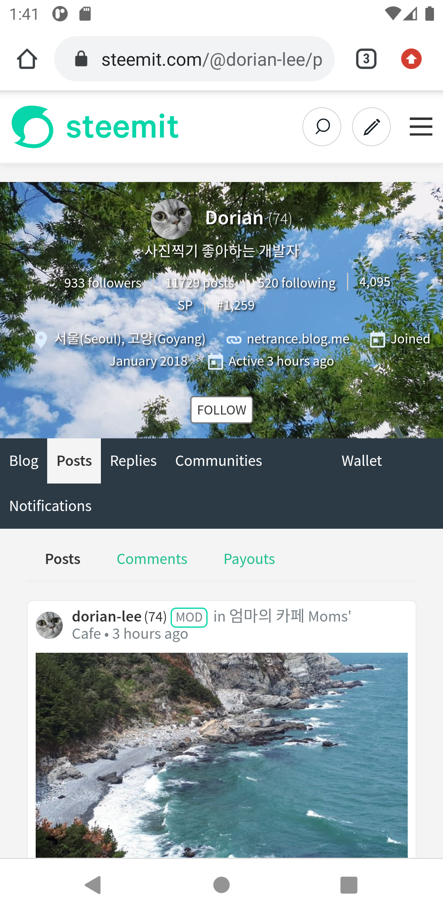

# Introduction

This sample project was created to define a spannable string using SpannableStringBuilder class.

---

# Screenshot

This application has one text view, and the view has two links, which are defined using setSpan method of SpannableStringBuilder class.

### Main Display

### From Main to Web Browser by clicking the first link

### From Main to Web Browser by clicking the second link

---

# References

* [How to set the part of the text view is clickable](https://stackoverflow.com/questions/10696986/how-to-set-the-part-of-the-text-view-is-clickable)
* (In Korean) [[Android] 글자에 옷을 입혀보자 (Spannable 사용하기)](https://re-build.tistory.com/13)