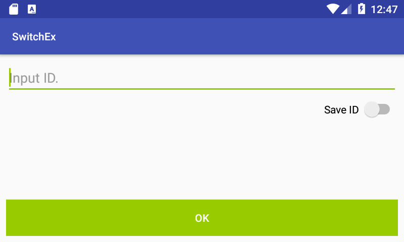
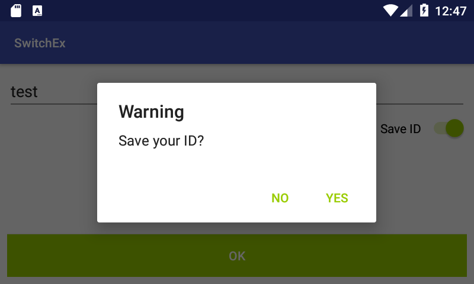
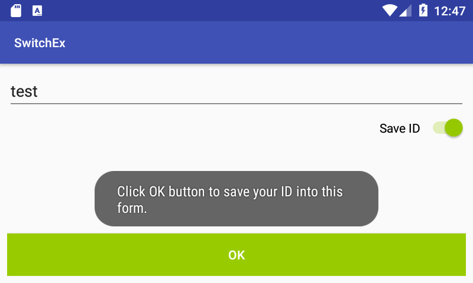
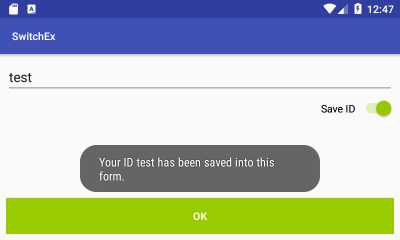
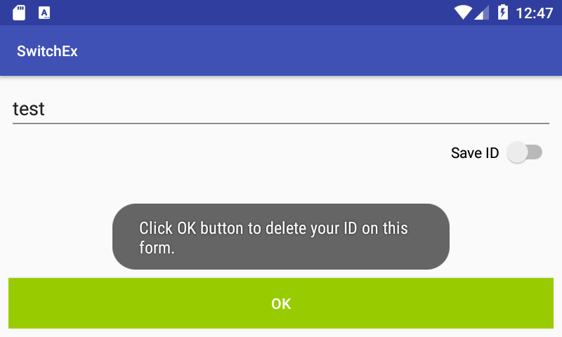

# 머리말

이 프로젝트는 Switch 뷰의 예를 보여 줍니다.

# 설명

이 프로젝트는 다음을 보여줍니다.
* XML 파일에서 Switch 뷰를 정의하는 방법
* Switch 뷰의 토글링(키거나 끔)을 처리하는 방법

# Screenshot

</img>

위 스크린샷은 예제 앱의 초기 화면입니다.

</img>

'Save ID' 스위치를 키면, 이 앱은 ID를 저장할지를 묻는 알림 팝업을 띄웁니다.

</img>

팝업의 YES를 클릭하면, 앱은 OK 버튼을 클릭하여 ID가 저장됨을 토스트로 알립니다.

</img>

OK를 클릭하면, 앱은 ID가 환경설정 파일에 저장되었음을 토스트로 알립니다

</img>

'Save ID' 스위치를 끄면, 앱은 OK 버튼을 클릭해야 ID가 삭제됨을 토스트로 알립니다.

# 참고

* Switch 클래스
  * https://developer.android.com/reference/android/widget/Switch
