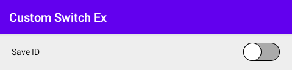

# 시작하며...

이 샘플 프로젝트는 외형을 바꾸는 커스텀 스위치 뷰의 예를 보여 드립니다.

---

# 스크린샷

MainActivity에는 ID를 변경할지 설정하는 레이아웃이 있습니다. 
사용자는 레이아웃의 오른쪽에 위치한 스위치를 키거나 끌 수 있습니다. 
스위치는 켜지거나 꺼질 때 이를 알리는 토스트를 앱이 띄워줍니다.



---

# 스위치 뷰의 외형을 바꾸는 방법

1. 스위치의 바디(body) 외형을 설정하는 XML 파일을 작성하세요. 
스위치를 킬 때와 끌 때를 구별해서 2개의 파일로 작성합니다.

**custom_switch_on.xml**

```
<?xml version="1.0" encoding="utf-8"?>
<shape
    xmlns:android="http://schemas.android.com/apk/res/android"
    android:shape="rectangle">

    <!-- Sets radius of switch (스위치의 코너 둥글기 설정) -->
    <corners
        android:radius="15dp" />

    <!-- Sets sizes (길이 설정) -->
    <size
        android:width="60dp"
        android:height="30dp" />

    <!-- Sets inner background (내부 배경색 설정) -->
    <solid
        android:color="@color/purple_200" />

    <!-- Sets stroke (테두리 선 설정) -->
    <stroke
        android:width="1dp"
        android:color="@color/black" />

</shape>
```

**custom_switch_off.xml**

```
<?xml version="1.0" encoding="utf-8"?>
<shape
    xmlns:android="http://schemas.android.com/apk/res/android"
    android:shape="rectangle">

    <!-- Sets radius of switch (스위치의 코너 둥글기 설정) -->
    <corners
        android:radius="15dp" />

    <!-- Sets sizes (길이 설정) -->
    <size
        android:width="60dp"
        android:height="30dp" />

    <!-- Sets inner background (내부 배경색 설정) -->
    <solid
        android:color="@android:color/darker_gray" />

    <!-- Sets stroke (테두리 선 설정) -->
    <stroke
        android:width="1dp"
        android:color="@color/black" />

</shape>
```

2. 스위치의 동그란 원(thumb)을 나타내는 XML 파일을 작성하세요.

**custom_switch_thumb.xml**

```
<?xml version="1.0" encoding="utf-8"?>
<shape
    xmlns:android="http://schemas.android.com/apk/res/android"
    android:shape="oval">

    <size
        android:width="30dp"
        android:height="30dp" />

    <solid
        android:color="@color/white" />

    <stroke
        android:width="1dp"
        android:color="@color/black" />

</shape>
```

3. 스위치가 켜지거나 꺼질 때의 외형을 설정하는 셀렉터(selector) 파일을 작성하세요. 
켜질 때의 drawable은 1에서 정의한 custom_switch_on을, 
꺼질 때의 drawable은 1에서 정의한 custom_switch_off를 선택하면 됩니다.

**custom_switch_selector.xml**

```
<?xml version="1.0" encoding="utf-8"?>
<selector xmlns:android="http://schemas.android.com/apk/res/android">

    <item
        android:drawable="@drawable/custom_switch_on"
        android:state_checked="true" />

    <item
        android:drawable="@drawable/custom_switch_off"
        android:state_checked="false" />

</selector>
```

4. 3에서 정의한 셀렉터를 스위치의 track으로, 
2에서 정의한 thumb을 스위치의 thumb으로 설정하세요.

```
<Switch
    android:id="@+id/swExample"
    android:layout_width="wrap_content"
    android:layout_height="wrap_content"
    android:track="@drawable/custom_switch_selector"
    android:thumb="@drawable/custom_switch_thumb" />
```

---

# 레퍼런스

* From developer.android.com
  * [Switch class](https://developer.android.com/reference/android/widget/Switch)
  * [안드로이드 스위치 버튼 꾸미기](https://black-jin0427.tistory.com/81)
