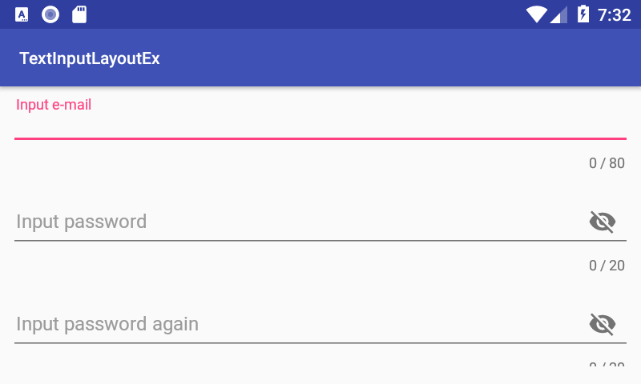
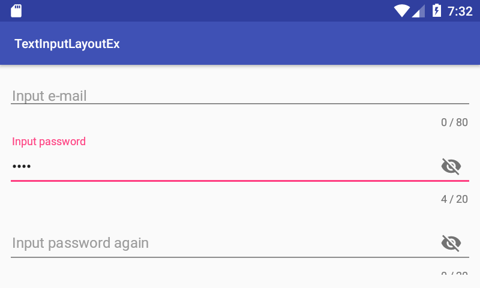
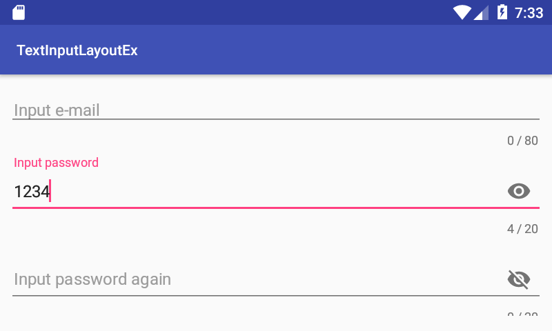

# 머리말

이 프로젝트는 TextInputLayout 뷰의 예를 보여 줍니다.

# 설명

이 프로젝트는 다음을 보여줍니다.
* XML 파일에서 TextInputLayout 뷰를 정의하는 방법

# Screenshot

</img>

위 스크린샷은 예제 앱의 초기 화면입니다.

</img>

패스워드를 입력해 봅니다. 이것은 숨겨져 있습니다.

</img>

TextInputLayout 뷰의 눈 모양 아이콘을 클릭하면, 숨겨진 비밀번호가 보입니다. 아이콘을 다시 클릭하면, 비밀번호는 다시 숨겨집니다.

# 참고

* TextInputLayout 클래스
  * https://developer.android.com/reference/android/support/design/widget/TextInputLayout
